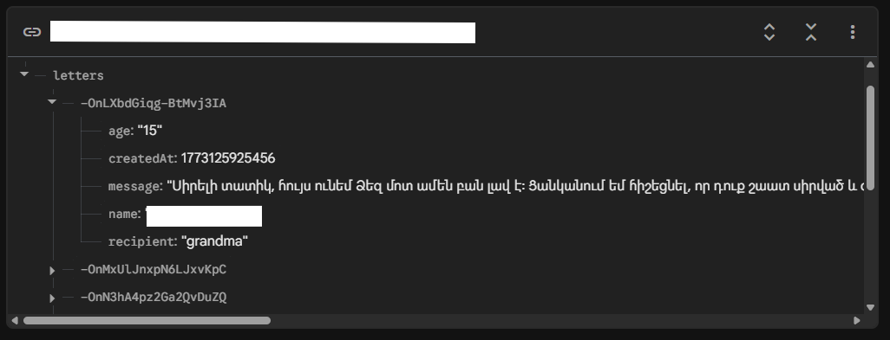
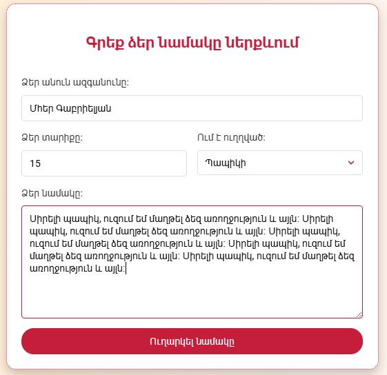

# 🌉 Generations Bridge (Serundneri Kamurj)

A secure web platform for sending letters to nursing homes.  
**STEAM Project** | Anania Shirakatsi Lyceum

Original page: [CLICK HERE](https://serundneri-kamurj.web.app/) (Archive mode, DEMO) | 
GitHub page: [CLICK HERE](https://twist-code1.github.io/Serundneri-kamurj/)

> **Real-world Impact:** 30+ letters delivered across 3 nursing homes (Feb–Mar 2026).

---

## 🛠 Tech Stack

* **Frontend:** HTML5, CSS3, JavaScript (ES6)
* **Backend:** Firebase Realtime Database
* **Visuals:** Chart.js, Custom SVG assets
* **Optimization:** Mobile-first responsive design

---

## ✨ Features & Security

* **Secure & Clean Data**: Double-checked on both the user side (JS) and the database (Firebase) to keep everything safe.

* **Mobile Friendly**: Fully optimized for phones, tablets, and desktops with a custom mobile menu.

* **Real-Time Messages**: Instant chat and data syncing powered by Firebase.

* **Easy-to-Read Stats**: Clear charts and visuals using Chart.js to track loneliness data.

---

## 📁 Structure

```text
.
├── index.html          # Core layout & Metadata
├── style.css           # Mobile-first responsive styles
├── script.js          # JS Validation, Firebase logic & Chart.js
├── photos/             # Project assets & icons
└── screenshots/        # Screenshots from Firebase
```

---

## 🖼️ Screenshots



